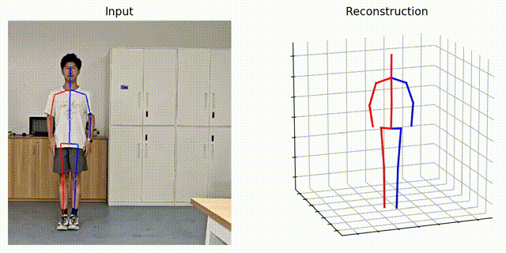

# C-FTS: Monocular Video 3D Human Pose Estimation Based on Cross-Attention of Frequency, Time and Space Domains

This is the official implementation of "Monocular Video 3D Human Pose Estimation Based on Cross-Attention of Frequency, Time and Space Domains" on PyTorch platform.

## Demo
<div align=center>




</div>

## The released codes include:
    checkpoint/:                        the folder for model weights of C-FTS
    dataset/:                           the folder for data loader
    common/:                            the folder for basic functions
    model/:                             the folder for C-FTS network
    run_human36M.py and run_3dhp.py:    the python code for C-FTS model training

## Environment
Make sure you have the following dependencies installed:
* PyTorch >= 0.4.0
* NumPy
* Matplotlib=3.1.0
> Our environment configuration is given in ```environment.yaml```, which can be used as a reference.

## Datasets

- [Human3.6M](http://vision.imar.ro/human3.6m): We set up the Human3.6M dataset in the same way as [VideoPose3D](https://github.com/facebookresearch/VideoPose3D/blob/master/DATASETS.md). 
- [MPI-INF-3DHP](https://vcai.mpi-inf.mpg.de/3dhp-dataset/): We set up the MPI-INF-3DHP dataset in the same way as [P-STMO](https://github.com/paTRICK-swk/P-STMO). 


## Training and testing

### Human 3.6M
For the training stage, please run:
```bash
python run_human36M.py -f 9 -b 128  --train 1 --layers 6 -s 3 --num_coeff_Time_kept 3 --model_downsample_rate 8 -c "human3.6M-model"
```
For the testing stage, please run:
```bash
python run_human36M.py -f 9 -b 128  --train 0 --layers 6 -s 1 --num_coeff_Time_kept 3 --model_downsample_rate 8 -c "human3.6M-model" --reload 1 --previous_dir ./checkpoint/your_best_model.pth
```

### MPI-INF-3DHP
For the training stage, please run:
```bash
python run_3dhp.py -f 9 -b 128  --train 1 --layers 6 -s 1 --num_coeff_Time_kept 3 --model_downsample_rate 8 -c "3dhp-model"
```
For the testing stage, please run:
```bash
python run_3dhp.py -f 9 -b 128  --train 0 --layers 6 -s 1 --num_coeff_Time_kept 3 --model_downsample_rate 8 -c "3dhp-model" --reload 1 --previous_dir ./checkpoint/your_best_model.pth
```


## Evaluation
You can download our pre-trained models from [Google Drive](https://drive.google.com/drive/folders/1kT_5QYnKgHQ5eCkqoX3N1ONztgpjHWTV?usp=sharing). Put them in the ./checkpoint directory.

Updating...

## Inference for the wild videos
According to STCFormer and MHFormer, make sure to download the YOLOv3 and HRNet pretrained models [here](https://drive.google.com/drive/folders/1_ENAMOsPM7FXmdYRbkwbFHgzQq_B_NQA) and put them in the './demo/lib/checkpoint' directory first. Then, you need to put your in-the-wild videos in the './demo/video' directory.

You can modify the 'get_pose3D' function in the 'vis.py' script according to your needs, including the checkpoint and model parameters, and then execute the following command:

```bash
 python demo/vis.py --video sample_video.mp4
```

## Citation

If you find this repo useful, please consider citing our paper:...

## Acknowledgement
Our code refers to the following repositories. We thank the authors for releasing the codes.

- [VideoPose3D](https://github.com/facebookresearch/VideoPose3D) 
- [StridedTransformer-Pose3D](https://github.com/Vegetebird/StridedTransformer-Pose3D) 
- [P-STMO](https://github.com/paTRICK-swk/P-STMO/tree/main) 
- [MHFormer](https://github.com/Vegetebird/MHFormer) 
- [MixSTE](https://github.com/JinluZhang1126/MixSTE) 
- [FTCM](https://github.com/zhenhuat/FTCM)
- [STCFormer](https://github.com/zhenhuat/STCFormer)

